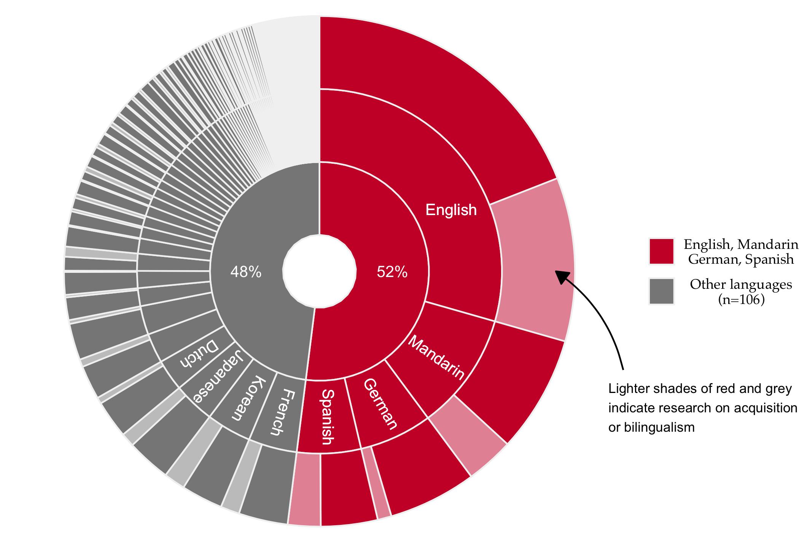

Scopus search using `rscopus` on the following terms:

- Information Structure
- Information Packaging
- Topic
- Focus
- Information Focus
- Contrastive Focus
- New Information
- Old Information
- Given
- Givenness
- Discourse anaphor
- Contrastiveness
- Presupposition
- Theme
- Rheme
- Presentational Focus

``` r
#
# Getting publication data via scopus
#
# set year thresholds
min_year <- 1960
max_year <- 2025

# prep empty output    
out_df <- NULL

# search by year (broken down by year because of 5k limit on records)
for(i in min_year:max_year){
  
  res <- scopus_search(
    query = paste(
      "TITLE-ABS-KEY({information structure} OR {information packaging} OR 
        topic OR focus OR {information focus} OR {contrastive focus} OR
        {new information} OR {old information} OR given OR givenness OR 
        {discourse anaphor} OR contrastiveness OR presupposition OR 
        theme OR rheme OR {presentational focus}) AND 
       PUBYEAR = ", i, "AND 
       SRCTYPE(j)"
    ),
    count = 25,
    max_count = 5000, 
    view = "COMPLETE"
  )

  n_records <- res$total_results
  
  if (n_records > 5000) {
    stop("Joseph, add a while() loop")
  }

  out_df <- bind_rows(out_df, gen_entries_to_df(res$entries)$df)
  
}

out_df |> 
  write_csv(here("data", "raw", glue("{Sys.Date()}_scopus_out.csv")))
```

In order to remove irrelevant hits, post-processsing also filtered the
data set to only include the following journals:

- Discourse Processes
- Journal of Pragmatics
- Psychological Science
- Journal of Phonetics
- Journal of Experimental Linguistics
- Applied Psycholinguistics
- Second Language Research
- Studies in Second Language Acquisition
- Bilingualism: Language and Cognition
- The Quarterly Journal of Experimental Psychology
- Cognition
- Journal of Memory and Language
- Journal of Experimental Psychology
- Learning, Memory, and Cognition
- Language, Cognition, and Neuroscience
- Behavioral and Brain Science
- Glossa
- Glossa Psycholinguistics
- Linguistic Approaches to Bilingualism
- Journal of Linguistics
- Natural Language and Linguistic Theory
- Linguistic Inquiry
- Probus
- Language, Cognition and Neuroscience
- Annual Review of Linguistics
- Frontiers in Language Science
- Frontiers in Psychology
- Languages
- Language
- Borealis
- Studia Linguistica
- Acta Linguistica Hungarica
- Linguistics

Next, we plot publications over time
(<a href="#fig-line-graph" class="quarto-xref">Figure 1</a>):

<div id="fig-line-graph">


Figure 1: Number of articles per year (left) and cumulative totals in
five-year intervals featuring information-structure terms in Scopus,
1960-2024.

</div>

We can also visualize the number of entries in a histogram
(<a href="#fig-bar-graph" class="quarto-xref">Figure 2</a>, not included
in the editorial):

<div id="fig-bar-graph">


Figure 2: Number of articles per year in five-year intervals featuring
information-structure terms in Scopus, 1960-2024.

</div>

<a href="#fig-journals" class="quarto-xref">Figure 3</a> (not included
in the editorial) looks at the number of publications from the journal
list we specified.

<div id="fig-journals">


Figure 3: Distribution of entries from our sample based on journal.

</div>

We searched the title, abstracts, and kewords for (1) evidence of what
language each article was studying, and (2) evidence that the article
was about SLA/Bilingualism. For (1), we used the
[worldlanguages](www.jvcasillas.com/worldlanguages) package to get a
list of language names (scraped from
https://en.wikipedia.org/wiki/List_of_language_names). The list includes
599 languages. For (2), we searched the title, abstract, and keywords
for any of the following terms: - Second Language Acquisition - SLA -
Second language - L2 - Bilingualism - Multilingualism - Language
acquisition - Language learning

<a href="#fig-langs" class="quarto-xref">Figure 4</a> shows the
porportion of the top 20 languages we could identify in our sample.

<div id="fig-langs">


Figure 4: Proportion of top 20 languages from scopus sample.

</div>

<a href="#fig-donut" class="quarto-xref">Figure 5</a> (Figure 2 in the
editorial) illustrates how the majority of articles come from English,
Mandarin, German or Spanish.

<div id="fig-donut">



Figure 5: Proportion of Scopus articles on information structure by
language, 1960-2024. The inner rings represent the disproportionate
distribution between English, Mandarin, German, and Spanish versus all
other languages in the sample (n = 110). The outer ring illustrates the
proportion of studies related to SLA/Bilingualism (opaque sections,
approx. 25%) versus studies involving monolinguals (non-opaque sections,
75%).

</div>

Approximately 25% of our sample could be identified as dealing with
SLA/Bilingualism (See
<a href="#fig-l2-prevalence" class="quarto-xref">Figure 6</a> and Table
1).

<div id="fig-l2-prevalence">


Figure 6

</div>

| is_l2 |   n | n_total |     prop |
|:------|----:|--------:|---------:|
| yes   | 319 |    1254 | 0.254386 |
| no    | 935 |    1254 | 0.745614 |

# References

- Carminati, M. N. (2002). The processing of Italian subject pronouns.
  Boston: University of Massachusetts.
- Ferreira, F., Engelhardt, P. E., and Jones, M. W. (2009). “Good enough
  language processing: a satisfying approach” in Proceedings of the 31st
  annual conference of the cognitive science society. eds. N.
  Taatgen, H. Rijn, J. Nerbonne and L. Schomaker (Austin, TX: Cognitive
  Science Society), 413–418.
- Féry, C., & Ishihara, S. (Eds.). (2016). The Oxford handbook of
  information structure. Oxford, Oxford University Press.
- Krifka, M. (2008). Basic notions of information structure. Acta
  Linguistica Hungarica, 55(3–4), 243–276.
- Krifka, M., & Musan, R. (Eds.). (2012). The expression of information
  structure. (Berlin: De Gruyter Mouton).
- Sorace, A. (2011). Pinning down the concept of “interface” in
  bilingualism. Linguis. Approach. Bilingual. 1, 1–33.
