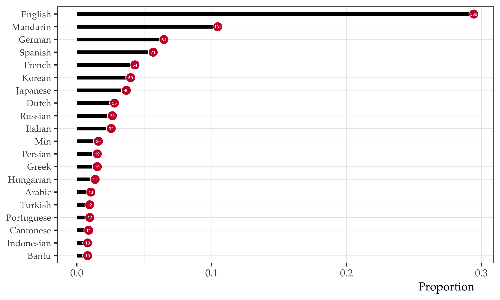

Figure 1

Figure 2

Figure 3

    NULL

Figure 4

Figure 5

| is_l2 |    n | n_total |      prop |
|------:|-----:|--------:|----------:|
|     1 |  290 |    1879 | 0.1543374 |
|     0 | 1589 |    1879 | 0.8456626 |

# References
